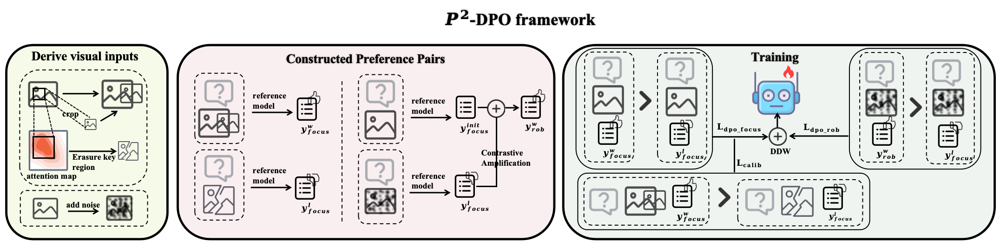
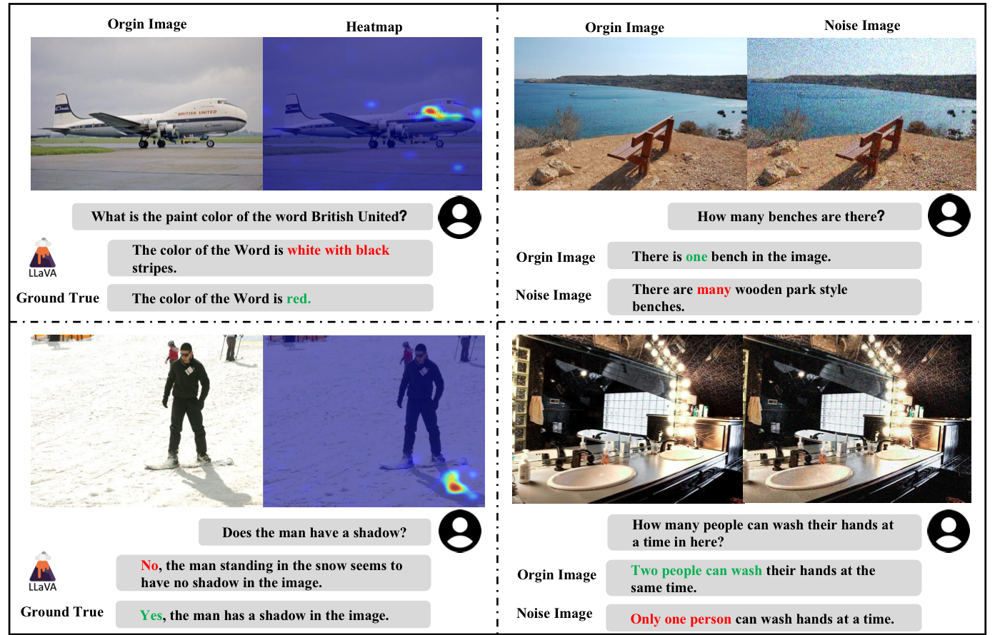
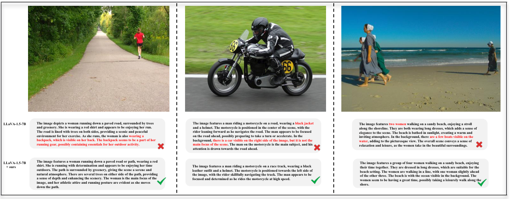
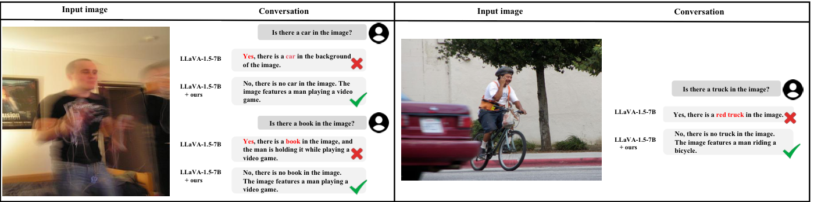

# P<sup>2</sup>-DPO

<p align="center">
  <strong>Grounding Hallucination in Perceptual Processing via Calibration Direct Preference Optimization</strong>
</p>

<p align="center">
  Ruipeng Zhang, Zhihao Li, Haozhang Yuan, C. L. Philip Chen, Tong Zhang
</p>

<p align="center">
  <a href="https://arxiv.org/abs/2606.03376"></a>
  <a href="https://github.com/ZrpChuang/P2-DPO"></a>
  
  
</p>

<p align="center">
  <em>P<sup>2</sup>-DPO trains large vision-language models to correct last-mile perceptual processing failures using on-policy, vision-aware preference pairs.</em>
</p>

<p align="center">
  
</p>

## Overview

Large Vision-Language Models can often look at the right visual region and still produce an ungrounded answer. P<sup>2</sup>-DPO targets this perceptual processing stage rather than relying on post-hoc text correction or costly human preference labels.

The framework builds two complementary preference signals from the model's own behavior:

- **Focus-and-Enhance Preference Pairs** contrast responses from salient-region enhanced inputs against responses from locally degraded inputs.
- **Visual Robustness Preference Pairs** contrast clean-image generations against responses induced by mild visual perturbations.
- **Calibration DPO** encourages the preferred response to be causally supported by visual evidence instead of merely favored as a text pattern.

<p align="center">
  
</p>

## Highlights

| Signal | Observation |
| --- | --- |
| Perceptual bottleneck | Improves AFR from 14.73 to 18.71 and processing accuracy from 66.29 to 70.10 on the high-focus subset. |
| Visual robustness | Maintains stronger POPE F1 under Gaussian noise, with over 4 F1 points gain at `sigma = 0.20`. |
| Annotation efficiency | Constructs preference pairs from the model's own outputs without using human preference labels from RLHF-V. |

## What Is Inside

| Area | Path | Purpose |
| --- | --- | --- |
| Preference generation | `Data_gen/` | Scripts for constructing focus-and-enhance and visual robustness pairs. |
| Training | `Training/` | P<sup>2</sup>-DPO and ablation training entry points. |
| Evaluation | `POPE/`, `AMBER/`, `MMHal-Bench/`, `Hallucination-Bench/` | Benchmark scripts for hallucination and trustworthiness evaluation. |
| Model helpers | `qwen2_vl/`, `AMBER/qwen2_vl/` | Utility code used by Qwen2-VL based evaluation paths. |

## Method

P<sup>2</sup>-DPO starts from an image-question pair and lets the reference model construct its own learning signal. The data is therefore on-policy and visually grounded by construction.

1. **Attend.** Obtain answer-to-image attention maps from the reference model.
2. **Intervene.** Produce enhanced, degraded, and noisy visual contexts from the original image.
3. **Compare.** Generate preference pairs that isolate perceptual bottlenecks and robustness failures.
4. **Calibrate.** Optimize with DPO plus calibration terms so visual interventions shape the preference margin.

## Qualitative Examples

<p align="center">
  
</p>

<p align="center">
  
</p>

## Repository Notes

This repository is organized as the official implementation accompanying the paper. The code is provided for method inspection, research comparison, and follow-up development. Running full training or evaluation requires local checkpoints, datasets, and path configuration.

<details>
<summary><strong>Environment</strong></summary>

```bash
pip install -r requirements.txt
```

</details>

<details>
<summary><strong>Preference Pair Generation</strong></summary>

Visual robustness pairs:

```bash
python Data_gen/rob_pair/gen/gendata_llava.py \
  --model-path /path/to/llava_model \
  --model-base /path/to/model_base \
  --image-folder /path/to/images \
  --question-file /path/to/questions.json \
  --answers-file /path/to/generated_pairs.jsonl \
  --conv-mode llava_v1 \
  --noise_step 600 \
  --use_cd \
  --cd_alpha 1 \
  --cd_beta 0.1
```

Focus-and-enhance pairs:

```bash
python Data_gen/focus_pair/generate.py
```

</details>

<details>
<summary><strong>Training</strong></summary>

Configure model, data, and output paths in the script before launching:

```bash
bash Training/scripts/v1_5/p2_dpo.sh
```

</details>

<details>
<summary><strong>Evaluation</strong></summary>

Evaluation entry points are grouped by benchmark:

```text
POPE/
AMBER/
MMHal-Bench/
Hallucination-Bench/
```

</details>

## Citation

```bibtex
@misc{zhang2026p2dpogroundinghallucinationperceptual,
      title={P$^2$-DPO: Grounding Hallucination in Perceptual Processing via Calibration Direct Preference Optimization}, 
      author={Ruipeng Zhang and Zhihao Li and Haozhang Yuan and C. L. Philip Chen and Tong Zhang},
      year={2026},
      eprint={2606.03376},
      archivePrefix={arXiv},
      primaryClass={cs.CV},
      url={https://arxiv.org/abs/2606.03376}, 
}
```
